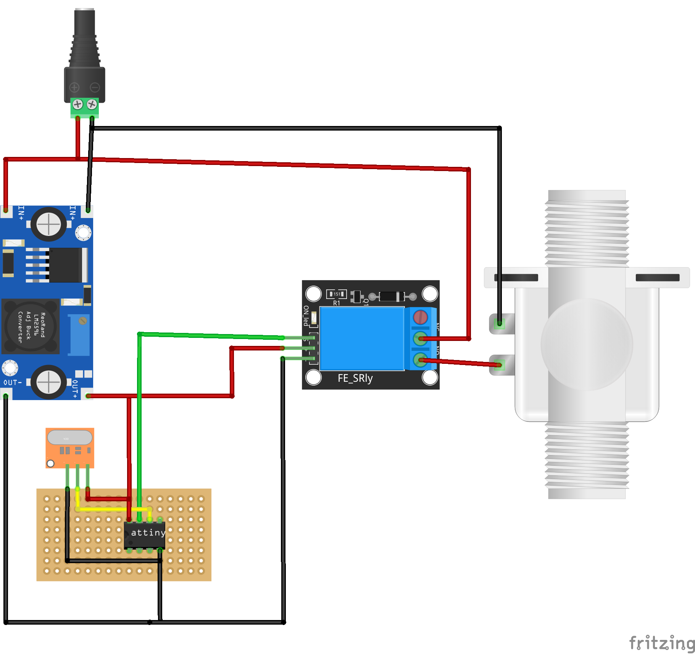

#Ventilsteuerung

Im Halloweenprojekt ist es vorgesehen, dass ein Drucklufteffekt eingebaut wird. Dazu wird an einem KOmpressor ein druckluftschlauch angeschlossen an dessen Ende ein Magnetventil befestigt ist. Im passenden Augenblick wird das Ventil geöffnet und ein Luftstoß erschrickt die ZUschauer.

Das Ventil ist ein günstiges 12V Magnetventil  von Amazon: [Heschen Magnetventil ](https://www.amazon.de/dp/B072ZZK9SD). Das Ventil ist vom Typ "normalerweise geschlossen" und öffnet sich wenn 12V Gleichspannung anliegt. Gesteuert werden soll das Ventil über einen Arduino bzw hier einen ATtiny85. Da dieser aber mit 12V betrieben wird, ist ein zusätzliches Gleichspannungsrelais erforderlich [Relais](https://www.amazon.de/dp/B07CNR7K9B). Das Relais wird im Normaly Open betriben, d.h. der Schalter ist normalerweise offen und es fließt kein Strom. So wird das Relais an das Magnentventil angeschlossen und der ATtiny am Relais und steuert dies.

Damit auch der Attiny mit stron versorgt wird bekommt er diesen über ein Stepdown Modul der 12V Stromversorgung für das Magnetrelais.

In der Grafik ist der Schaltplan. Attiny wird mit dem Funkmodul verbunden und steuert das Relais. 
Der Code zum Auslösen des Relais ist die (3) ein 8 bit Wert der über RCSwitch dekodiert wurde.

Wird das Signal erkannt, öffnet der Prozessor das Ventil für einen bestimmte Zeit, schließt es und wartet erneut auf das nächste Signal.

Da es für den Effekt wichtig sein kann regeln zu können, wie lange das Ventil auf ist, zb. 300 statt 100 Millisekunden gibt es einen zweiten Code. Dieser kann wie folgt aussehen:
99TTTT, eine sechstellige Zahl. Beginnend mit dem Startcode und den folgenden vier Ziffern welche die Dauer des Luftstoßes in Millisekunden darstellen. Dieser neue Wert wird im EEPROM abgelegt und steht bei Neustart wieder zur Verfügung.

